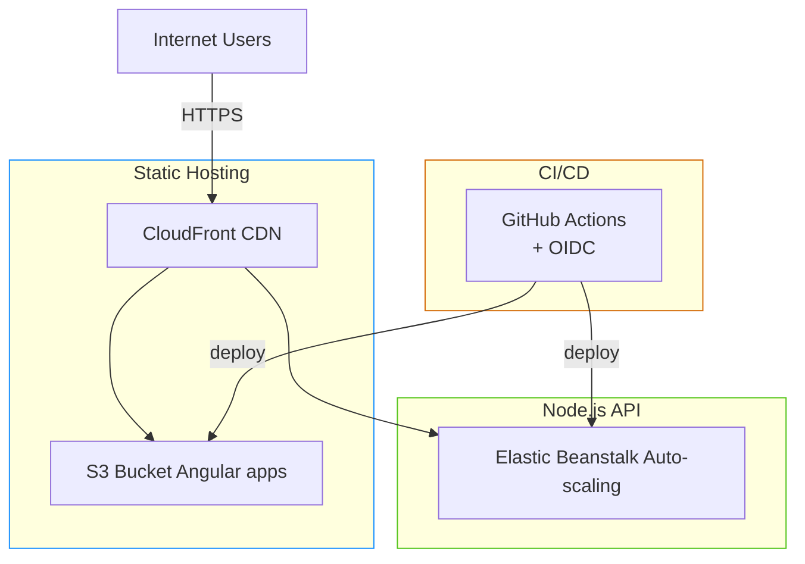

# HRM-Demo

## Overview
App1: HR-Core (analogous to HR Management Core System)
App2: HR-Metrics (analogous to HR Metrics and Improvements)
App3: HR-Activities (analogous to HR Activities)

Each is a full-stack mini-app:

- Frontend (Angular): Built with Angular CLI. Start page shows dynamic content (fetches and displays current server time via API). Includes at least one static resource (a logo image). Has navigation links to the other two apps (using hardcoded URLs for demo; in production, these would be configurable).
- Backend (Node.js/Express): Simple server that serves the built Angular static files and provides a /time API endpoint returning server time (to simulate dynamic, resource-intensive integrations).

## Deployment Architecture
Based on the HRM context (load-balanced installation servers, modular components, integrations, peak usage patterns), I've designed a PaaS-optimized architecture using best practices like microservices, scalability, and zero-downtime deployments. This evaluates restructuring HRM for PaaS: shifting from monolithic on-prem to modular, cloud-native setup reduces ops costs, handles peaks (e.g., post-lunch spikes), and supports 10+ integrations via APIs.

### Key Patterns Applied:
- Microservices: Each "module" (app) as a separate service for independent scaling (e.g., HR-Activities scales during peaks).
- Containerization: Docker for portability.
- Auto-Scaling: Horizontal scaling based on CPU/memory.
- Load Balancing: Built-in PaaS LB/WAF for traffic distribution and security.
- Configuration Management: Environment variables for keys/configs (no hard-coded; use secrets management).
- Database: For demo, in-memory (no real DB needed); in real HRM, use managed PaaS DB like Azure SQL, integrated via LDAP proxy.
- Monitoring/CI/CD: Integrated PaaS tools for logs, metrics; GitHub Actions for pipelines.
- Resilience: Health checks, retries for integrations (simulated).
- Security: HTTPS enforced, no exposed ports beyond necessary.

## Deployment Architecture (AWS + GitHub Actions)

### Chosen Services & Why

| Layer       | Service                        | Reason                                                                                  | Advantages vs Alternatives                                  |
|-------------|--------------------------------|-----------------------------------------------------------------------------------------------------------------------|-------------------------------------------------------------|
| **Frontend** | S3 + CloudFront                | Static Angular apps = perfect fit for S3. CloudFront gives global CDN, HTTPS, and cache invalidation.              | Cheapest (~$2/month), fastest edge delivery, zero servers  |
| **Backend**  | Elastic Beanstalk (Node.js)    | Full Node.js PaaS with auto-scaling, health checks, rolling deploys, CloudWatch logs/metrics out of the box.       | 3–5× cheaper than ECS/Fargate, zero ops, perfect for Nx    |
| **CI/CD**    | GitHub Actions + OIDC          | Native integration, free minutes, matrix jobs deploy all 6 artifacts in parallel.                                    | No extra cost, secure (no stored AWS keys)                  |



### Live URLs (example)
- Core:       
- Metrics:    
- Activities: 

Every push to `main` → fully automated deploy.

Deployment docs

1. Create an IAM OIDC Identity Provider for GitHub (5 min)
This removes the need for AWS keys in GitHub Secrets — 100% secure

Open AWS Console → IAM → Identity providers → Add provider
Provider type: OpenID Connect
Provider URL: https://token.actions.githubusercontent.com
Audience: `sts.amazonaws.com
Click “Get thumbprint” → Add provider
→ Name it GitHubActionsProvider

2. Create one IAM Role that GitHub Actions will assume (5 min)

IAM → Roles → Create role
Trusted entity type: Web identity
Identity provider: the one you just created (GitHubActionsProvider)
Audience: sts.amazonaws.com
Add condition (important!):
StringEquals
Key: token.actions.githubusercontent.com:sub
Value: repo:YOUR_GITHUB_USERNAME/HRM-Demo:ref:refs/heads/main
(replace with your real username/repo)
Attach these managed policies:
AmazonS3FullAccess (or a custom narrower one)
AWSElasticBeanstalkFullAccess
CloudFrontFullAccess (or custom)
AWSCloudFormationFullAccess (Beanstalk needs it)

Name the role: GitHubActionsDeployRole
Copy the full ARN — you’ll need it in step 8

3. Create 3 S3 Buckets for the frontends (5 min)
For each app create one bucket (must be globally unique names):
texthrm-core-frontend
hrm-metrics-frontend
hrm-activities-frontend
Settings for each bucket:

Block ALL public access → OFF (we need public read)
Enable Static website hosting → Index document: index.html
Bucket policy (paste this and replace bucket name):

JSON{
  "Version": "2012-10-17",
  "Statement": [
    {
      "Sid": "PublicReadGetObject",
      "Effect": "Allow",
      "Principal": "*",
      "Action": "s3:GetObject",
      "Resource": "arn:aws:s3:::hrm-core-frontend/*"
    }
  ]
}
4. Create 3 CloudFront Distributions (one per frontend) (8 min)
For each bucket:

CloudFront → Create distribution
Origin domain: choose your S3 bucket (the .s3.amazonaws.com one)
Viewer protocol policy: Redirect HTTP → HTTPS
Price class: Use all edge locations (best performance)
Alternate domain name (CNAME): core.yourdomain.com (optional but nice)
Default root object: index.html
Create → wait 5–10 min until Deployed
Copy the Distribution ID (e.g. E1234567890ABC) — you will add it to GitHub Secrets

5. Create one Elastic Beanstalk Application + 3 Environments (8 min)

Elastic Beanstalk → Create application
Name: hrm-paas
For each backend create an environment:
Application name: hrm-paas
Environment name:
hrm-core-backend-env
hrm-metrics-backend-env
hrm-activities-backend-env
Platform: Node.js 20 running on 64bit Amazon Linux 2023
Application code: Sample application (we’ll overwrite it)
Create environment → wait ~5 min


6. Add secrets to your GitHub repository (2 min)
Go to your repo → Settings → Secrets and variables → Actions → New repository secret
Add these 6 secrets:


Secret nameValue (copy from AWS)AWS_REGIONeu-central-1 (or your region)CF_DISTRIBUTION_coreDistribution ID of core CloudFrontCF_DISTRIBUTION_metricsDistribution ID of metrics CloudFrontCF_DISTRIBUTION_activitiesDistribution ID of activities CloudFrontGITHUB_ACTIONS_ROLE_ARNARN of the role you created in step 2
1. Final GitHub Actions workflow 
.github/workflows/deploy.yml

```yml
name: Deploy to AWS

on:
  push:
    branches: [ main ]

jobs:
  deploy:
    runs-on: ubuntu-latest
    permissions:
      contents: read
      id-token: write

    strategy:
      matrix:
        service: [core, metrics, activities]

    steps:
      - uses: actions/checkout@v4

      - name: Setup Node
        uses: actions/setup-node@v4
        with:
          node-version: 20
          cache: npm

      - run: npm ci
      - run: npx nx run-many -t build --projects=${{ matrix.service }}-frontend},${{ matrix.service }}-backend --configuration=production

      - name: Configure AWS credentials (OIDC)
        uses: aws-actions/configure-aws-credentials@v4
        with:
          role-to-assume: ${{ secrets.GITHUB_ACTIONS_ROLE_ARN }}
          aws-region: ${{ secrets.AWS_REGION }}

      }}

      - name: Deploy Frontend → S3 + CloudFront
        run: |
          aws s3 sync dist/apps/${{ matrix.service }}/frontend s3://hrm-${{ matrix.service }}-frontend --delete --cache-control max-age=60
          aws cloudfront create-invalidation --distribution-id ${{ secrets['CF_DISTRIBUTION_' matrix.service] }} --paths "/*"

      - name: Deploy Backend → Elastic Beanstalk
        run: |
          cd dist/apps/${{ matrix.service }}/backend
          zip -r ../../${{ matrix.service }}-backend.zip .
          aws elasticbeanstalk create-application-version \
            --application-name hrm-paas \
            --version-label "v${{ github.sha::8 }}" \
            --source-bundle S3Bucket="hrm-deployments",S3Key="${{ matrix.service }}-backend.zip"
          aws elasticbeanstalk update-environment \
            --application-name hrm-paas \
            --environment-name hrm-${{ matrix.service }}-backend-env \
            --version-label "v${{ github.sha::8 }}"
```

## Project structure
hrm-project/
├── apps/                  
│   ├── hr-core/           
│   │   ├── backend/       # Node/Express backend
│   │   │   ├── src/
│   │   │   │   ├── config/       # Env configs, keys (e.g., db, auth)
│   │   │   │   ├── controllers/  # Handle requests/responses
│   │   │   │   ├── middleware/   # Auth, logging, error handling
│   │   │   │   ├── models/       # Data schemas (e.g., Mongoose if using Mongo)
│   │   │   │   ├── routes/       # API endpoints
│   │   │   │   ├── services/     # Business logic, integrations (e.g., LDAP, external APIs)
│   │   │   │   ├── utils/        # Helpers (e.g., validators, encryptors)
│   │   │   │   └── app.js        # Main Express app setup
│   │   │   ├── tests/            # Unit/integration tests (Jest)
│   │   │   ├── .env.example      # Sample env file
│   │   │   ├── Dockerfile        # For containerization
│   │   │   ├── package.json      # Backend deps (express, dotenv, etc.)
│   │   │   └── tsconfig.json     # If using TypeScript
│   │   └── frontend/      # Angular frontend
│   │       ├── src/
│   │       │   ├── app/
│   │       │   │   ├── core/          # Shared services, guards, interceptors
│   │       │   │   ├── features/      # Feature modules
│   │       │   │   ├── shared/        # Reusable components, pipes, directives
│   │       │   │   ├── app.component.ts
│   │       │   │   ├── app.module.ts
│   │       │   │   └── app-routing.module.ts
│   │       │   ├── assets/            # Static files (images, CSS, PDFs)
│   │       │   ├── environments/      # Env configs (dev/prod)
│   │       │   └── index.html         # Entry point
│   │       ├── angular.json           # Angular CLI config
│   │       ├── Dockerfile             # For containerization (optional if serving via backend)
│   │       ├── package.json           # Frontend deps (@angular/core, rxjs, etc.)
│   │       └── tsconfig.json
│   ├── hr-metrics/    # Similar structure as hr-core
│   └── hr-activities/ # Similar structure as hr-core
├── libs/                  # Shared libraries (e.g., common utils, types)
├── tools/                 # Scripts for CI/CD, migrations
├── .eslintrc.json         # Linting rules
├── .prettierrc            # Formatting
├── .gitignore
├── nx.json                # If using Nx for monorepo
├── package.json           # Root deps (dev tools like husky for hooks)
├── README.md              # Project overview, setup instructions
└── docker-compose.yml     # For local dev (compose all apps with DB proxy)

## Building / Running

Running command
```bash
nx run-many -t serve -p hr-core-backend hr-metrics-backend hr-activities-backend --parallel=3
```