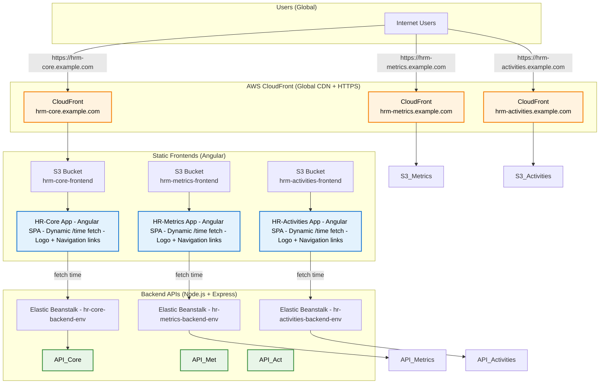
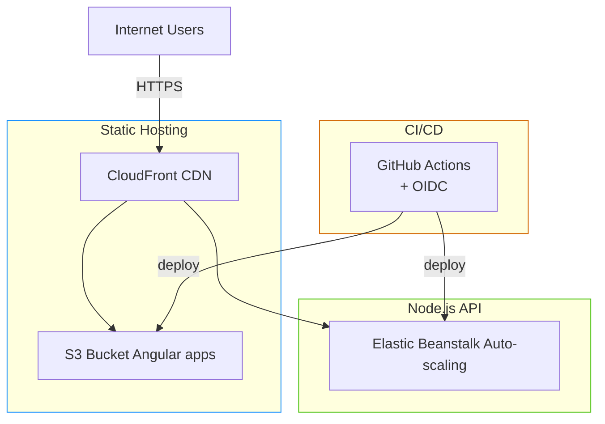

# HRM-Demo

## Overview
App1: HR-Core (analogous to HR Management Core System)
App2: HR-Metrics (analogous to HR Metrics and Improvements)
App3: HR-Activities (analogous to HR Activities)

Each is a full-stack mini-app:

- Frontend (Angular): Built with Angular CLI. Start page shows dynamic content (fetches and displays current server time via API). Includes at least one static resource (a logo image). Has navigation links to the other two apps (using hardcoded URLs for demo; in production, these would be configurable).
- Backend (Node.js/Express): Simple server that serves the built Angular static files and provides a /time API endpoint returning server time (to simulate dynamic, resource-intensive integrations).

## Deployment Architecture
Based on the HRM context (load-balanced installation servers, modular components, integrations, peak usage patterns), I've designed a PaaS-optimized architecture using best practices like microservices, scalability, and zero-downtime deployments. This evaluates restructuring HRM for PaaS: shifting from monolithic on-prem to modular, cloud-native setup reduces ops costs, handles peaks (e.g., post-lunch spikes), and supports 10+ integrations via APIs.



### Key Patterns Applied:
- Microservices: Each "module" (app) as a separate service for independent scaling (e.g., HR-Activities scales during peaks).
- Containerization: Docker for portability.
- Auto-Scaling: Horizontal scaling based on CPU/memory.
- Load Balancing: Built-in PaaS LB/WAF for traffic distribution and security.
- Configuration Management: Environment variables for keys/configs (no hard-coded; use secrets management).
- Database: For demo, in-memory (no real DB needed); in real HRM, use managed PaaS DB like Azure SQL, integrated via LDAP proxy.
- Monitoring/CI/CD: Integrated PaaS tools for logs, metrics; GitHub Actions for pipelines.
- Resilience: Health checks, retries for integrations (simulated).
- Security: HTTPS enforced, no exposed ports beyond necessary.

## Deployment Architecture (AWS + GitHub Actions)

### Chosen Services & Why

| Layer       | Service                        | Reason                                                                                  | Advantages vs Alternatives                                  |
|-------------|--------------------------------|-----------------------------------------------------------------------------------------------------------------------|-------------------------------------------------------------|
| **Frontend** | S3 + CloudFront                | Static Angular apps = perfect fit for S3. CloudFront gives global CDN, HTTPS, and cache invalidation.              | Cheapest (~$2/month), fastest edge delivery, zero servers  |
| **Backend**  | Elastic Beanstalk (Node.js)    | Full Node.js PaaS with auto-scaling, health checks, rolling deploys, CloudWatch logs/metrics out of the box.       | 3–5× cheaper than ECS/Fargate, zero ops, perfect for Nx    |
| **CI/CD**    | GitHub Actions + OIDC          | Native integration, free minutes, matrix jobs deploy all 6 artifacts in parallel.                                    | No extra cost, secure (no stored AWS keys)                  |



### Live URLs (example)
- Core:       
- Metrics:    
- Activities: 

Every push to `main` → fully automated deploy.

## Deployment docs

1. Create an IAM OIDC Identity Provider for GitHub
  This removes the need for AWS keys in GitHub Secrets — 100% secure

  Open AWS Console → IAM → Identity providers → Add provider
  Provider type: OpenID Connect
  Provider URL: https://token.actions.githubusercontent.com
  Audience: `sts.amazonaws.com
  Click “Get thumbprint” → Add provider
  → Name it GitHubActionsProvider

2. Create one IAM Role that GitHub Actions will assume
  IAM → Roles → Create role

  Trusted entity type: Web identity

  Identity provider: the one you just created (GitHubActionsProvider)

  Audience: sts.amazonaws.com

  Add condition (important!):
  StringEquals
  Key: token.actions.githubusercontent.com:sub
  Value: repo:YOUR_GITHUB_USERNAME/HRM-Demo:ref:refs/heads/main
  (replace with your real username/repo)

  Attach these managed policies:
  AmazonS3FullAccess (or a custom narrower one)
  AWSElasticBeanstalkFullAccess
  CloudFrontFullAccess (or custom)
  AWSCloudFormationFullAccess (Beanstalk needs it)

  Name the role: GitHubActionsDeployRole
  Copy the full ARN — you’ll need it in step 8

1. Create 3 S3 Buckets for the frontends
  For each app create one bucket (must be globally unique names):
  texthrm-core-frontend
  hrm-metrics-frontend
  hrm-activities-frontend
  
  Settings for each bucket:

  Block ALL public access → OFF (we need public read)
  Enable Static website hosting → Index document: index.html
  Bucket policy (paste this and replace bucket name):

  JSON{
    "Version": "2012-10-17",
    "Statement": [
      {
        "Sid": "PublicReadGetObject",
        "Effect": "Allow",
        "Principal": "*",
        "Action": "s3:GetObject",
        "Resource": "arn:aws:s3:::hrm-core-frontend/*"
      }
    ]
  }

1. Create 3 CloudFront Distributions (one per frontend)
  For each bucket:

  CloudFront → Create distribution
  Origin domain: choose your S3 bucket (the .s3.amazonaws.com one)
  Viewer protocol policy: Redirect HTTP → HTTPS
  Price class: Use all edge locations (best performance)
  Alternate domain name (CNAME): core.yourdomain.com (optional but nice)
  Default root object: index.html
  Create → wait 5–10 min until Deployed
  Copy the Distribution ID -> Add it to Github secrets

1. Create one Elastic Beanstalk Application + 3 Environments

Elastic Beanstalk → Create application
Name: hrm-paas
For each backend create an environment:
Application name: hrm-paas
Environment name:
hrm-core-backend-env
hrm-metrics-backend-env
hrm-activities-backend-env
Platform: Node.js 20 running on 64bit Amazon Linux 2023
Application code: Sample application (we’ll overwrite it)
Create environment → wait ~5 min


6. Add secrets to your GitHub repository (2 min)
  Go to your repo → Settings → Secrets and variables → Actions → New repository secret
  Add these 6 secrets:


  Secret nameValue (copy from AWS)
  
  AWS_REGIONeu-central-1 (or your region)
  
  CF_DISTRIBUTION_coreDistribution ID of core CloudFront
  
  CF_DISTRIBUTION_metricsDistribution ID of metrics CloudFront
  
  CF_DISTRIBUTION_activitiesDistribution ID of activities CloudFront
  
  GITHUB_ACTIONS_ROLE_ARNARN of the role you created in step 2
  
7. Final GitHub Actions workflow 
  .github/workflows/deploy.yml

```yml
name: Deploy HRM PaaS to AWS

on:
  push:
    branches: [ main ]
  workflow_dispatch:

permissions:
  contents: read
  id-token: write

jobs:
  # ====================================================
  # BUILD PHASE (6 Parallel Jobs)
  # ====================================================
  build:
    name: Build ${{ matrix.service }}-${{ matrix.type }}
    runs-on: ubuntu-latest
    timeout-minutes: 45
    strategy:
      fail-fast: false
      matrix:
        service: [ hr-core, hr-metrics, hr-activities ]
        type: [ frontend, backend ]

    steps:
      - name: Checkout code
        uses: actions/checkout@v4
        with:
          path: src

      - name: Setup Node.js
        uses: actions/setup-node@v4
        with:
          node-version: 20

      # 1. SAFETY: Swap Space
      - name: Add Swap Space
        run: |
          sudo fallocate -l 4G /swapfile_gha
          sudo chmod 600 /swapfile_gha
          sudo mkswap /swapfile_gha
          sudo swapon /swapfile_gha

      # 2. MONITOR: Watch for freezes
      - name: Start Resource Monitor
        run: |
          (while true; do
            echo "--- [Monitor] Memory & CPU Usage ---"
            free -m
            uptime
            echo "------------------------------------"
            sleep 30
          done) &

      # 3. INSTALL & BUILD
      - name: Install dependencies + Build
        run: |
          cd src/src

          # 1. ENVIRONMENT
          export CI=true
          export FORCE_COLOR=0
          export GENERATE_SOURCEMAP=false 
          # Keep high memory limit (Swap handles the rest)
          export NODE_OPTIONS="--max-old-space-size=6144"

          # 2. INSTALL
          npm ci --legacy-peer-deps --omit=optional --no-audit --no-fund --ignore-scripts

          # 3. FORCE UPGRADE (Vital to prevent the hang)
          echo "Forcing SWC & Esbuild Installation..."
          npm install --save-dev \
            @swc/core@latest \
            @swc/helpers@latest \
            esbuild@latest \
            @esbuild/linux-x64@latest \
            --ignore-scripts
            
          rm -rf node_modules/.cache .nx

          # 4. BUILD          
          echo "Build ${{ matrix.service }}-frontend..."
          timeout 25m ./node_modules/.bin/nx build ${{ matrix.service }}-frontend \
            --configuration=production \
            --parallel=1 \
            --skip-nx-cache \
            --sourceMap=false

          echo "Build ${{ matrix.service }}-backend..."
          timeout 25m ./node_modules/.bin/nx build ${{ matrix.service }}-backend \
            --configuration=production \
            --parallel=1 \
            --skip-nx-cache \
            --sourceMap=false

      - name: Debug - List Build Output
        run: |
          echo "Looking for dist folder..."
          ls -R src/src/dist || echo "Dist folder not found in src/src/dist"

      - name: Upload Artifact
        uses: actions/upload-artifact@v4
        with:
          name: build-${{ matrix.service }}-${{ matrix.type }}
          path: src/src/dist/apps/${{ matrix.service }}/${{ matrix.type }}
          if-no-files-found: error
          retention-days: 1

  # ====================================================
  # DEPLOY PHASE
  # ====================================================
  deploy:
    needs: build
    runs-on: ubuntu-latest
    timeout-minutes: 15
    strategy:
      matrix:
        service: [ hr-core, hr-metrics, hr-activities ]
    
    steps:
      - name: Configure AWS credentials
        uses: aws-actions/configure-aws-credentials@v4
        with:
          role-to-assume: ${{ secrets.ACTIONS_GITHUB_ROLE_ARN }}
          aws-region: ${{ secrets.AWS_REGION }}

      - name: Download Frontend Artifact
        uses: actions/download-artifact@v4
        with:
          name: build-${{ matrix.service }}-frontend
          path: dist_frontend

      - name: Download Backend Artifact
        uses: actions/download-artifact@v4
        with:
          name: build-${{ matrix.service }}-backend
          path: dist_backend

      - name: Deploy Frontend
        env:
          # 1. SECRET MAPPING 
          CLOUDFRONT_ID: ${{ 
            matrix.service == 'hr-core' && secrets.CF_DISTRIBUTION_HR_CORE || 
            matrix.service == 'hr-metrics' && secrets.CF_DISTRIBUTION_HR_METRICS || 
            matrix.service == 'hr-activities' && secrets.CF_DISTRIBUTION_HR_ACTIVITIES 
            }}
        run: |
          # 2. FIX S3 PATH 
          # We define the source path. If the 'browser' subfolder exists (Angular), we use that.
          SOURCE_PATH="dist_frontend"
          if [ -d "dist_frontend/browser" ]; then
            SOURCE_PATH="dist_frontend/browser"
          fi
          
          echo "Deploying content from $SOURCE_PATH to root of S3..."

          # We sync the CONTENTS of the browser folder to the ROOT of the bucket
          aws s3 sync $SOURCE_PATH s3://hrm-${{ matrix.service }}-frontend/ \
            --delete \
            --cache-control "public, max-age=60"

          # 3. DEBUG & INVALIDATE CLOUDFRONT
          if [ -z "$CLOUDFRONT_ID" ]; then
            echo "❌ ERROR: CloudFront Secret is empty!"
            echo "Expected one of these secrets to exist:"
            echo " - CF_DISTRIBUTION_HR_CORE"
            echo " - CF_DISTRIBUTION_HR_METRICS"
            echo " - CF_DISTRIBUTION_HR_ACTIVITIES"
            exit 1
          fi

          echo "✅ Found Distribution ID: $CLOUDFRONT_ID"
          aws cloudfront create-invalidation --distribution-id "$CLOUDFRONT_ID" --paths "/*"
          
      - name: Deploy Backend
        run: |
          # 1. PREPARE NAMES
          SERVICE_NAME="${{ matrix.service }}"
          CLEAN_NAME=${SERVICE_NAME#hr-} 
          DEPLOY_BUCKET="hrm-deployments-mf" 

          # 2. Create Procfile
          cd dist_backend
          
          # This tells AWS explicitly how to start the app
          echo "web: node main.js" > Procfile
          
          # 3. ZIP ARTIFACT
          # We zip '.' (current directory) which now includes main.js, package.json, AND Procfile
          zip -r ../${SERVICE_NAME}-backend.zip . > /dev/null
          cd ..
          
          # 4. UPLOAD TO S3
          echo "Uploading to S3..."
          aws s3 cp ${SERVICE_NAME}-backend.zip s3://$DEPLOY_BUCKET/${SERVICE_NAME}-backend.zip

          # 5. CREATE UNIQUE VERSION LABEL
          VERSION="gha-${{ github.run_id }}-${{ github.run_attempt }}-${SERVICE_NAME}"
          
          aws elasticbeanstalk create-application-version \
            --application-name hrm-paas \
            --version-label "$VERSION" \
            --source-bundle S3Bucket=$DEPLOY_BUCKET,S3Key="${SERVICE_NAME}-backend.zip" \
            --no-auto-create-application
          
          # 6. UPDATE ENVIRONMENT
          aws elasticbeanstalk update-environment \
            --application-name hrm-paas \
            --environment-name hrm-${CLEAN_NAME}-backend-env \
            --version-label "$VERSION"
```

## Building / Running local

Running command
```bash
nx run-many -t serve -p hr-core-backend hr-metrics-backend hr-activities-backend --parallel=3
```